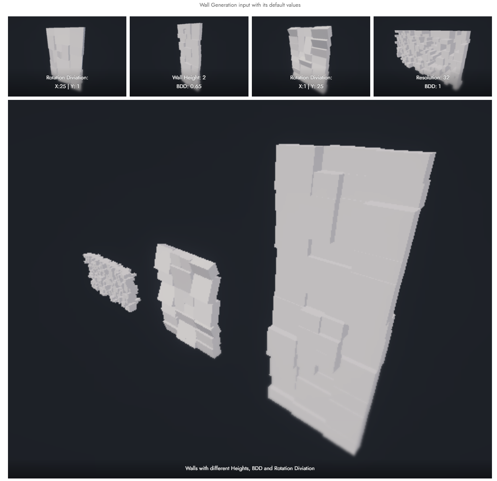

# Code Showcase

## Project "Unity Procedual Walls and Pathways"

Source Code: [ GitHub ·  Unity-Procedual-Walls-And-Paths/WallGenerationFloodfill.cs](https://github.com/kianniek/Unity-Procedual-Walls-And-Paths/blob/main/GPE_RnD_KianHamidi/Assets/Scripts/WallGenerationFloodfill.cs)

Resultaat:

Bron figuur: [ Procedualy generated walls and pathways ; Gameplay Engineering](https://summit-2324-sem2.game-lab.nl/2024/02/28/procedualy-generated-walls-and-pathways/)

---

Source Code: [ GitHub · Unity-Procedual-Walls-And-Paths/SplineGenerator.cs](https://github.com/kianniek/Unity-Procedual-Walls-And-Paths/blob/main/GPE_RnD_KianHamidi/Assets/Scripts/SplineGenerator.cs)

Resultaat:

Bron figuur: [ Procedualy generated walls and pathways ; Gameplay Engineering](https://summit-2324-sem2.game-lab.nl/2024/02/28/procedualy-generated-walls-and-pathways/)

---

Hieronder is te zien hoe deze twee systemen samenwerken om zo een muur te genereren:

Bron: [ Procedualy generated walls and pathways ; Gameplay Engineering](https://summit-2324-sem2.game-lab.nl/2024/02/28/procedualy-generated-walls-and-pathways/)

---

Eindresultaat met de gebruiker die een spline kan tekenen waarna er met een floodfill algoritme de muur wordt geplaatst.

Bron: [ Procedualy generated walls and pathways ; Gameplay Engineering](https://summit-2324-sem2.game-lab.nl/2024/02/28/procedualy-generated-walls-and-pathways/)

## Project "Yuverta-AR-Route"

Source code: [ GitHub · Green-AR-Route/PaintManager.cs](https://github.com/kianniek/Green-AR-Route/blob/development/Yuverta%20AR%20Route/Assets/Scripts/PaintManager.cs)

Resultaat:

